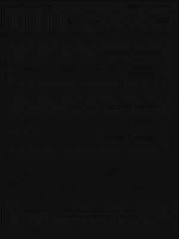

# 🌟 **My Awesome StudyPro App** 🎓

🎉 **Welcome to your ultimate student assistant!** 🎉  
Manage your lessons, tasks, and grades effortlessly with this easy-to-use, feature-packed app! Whether you're tackling assignments 📝, organizing your weekly schedule 📅, or tracking your grades 📊, this app has got you covered.



---

## ✨ **Features at a Glance**  
Here’s what makes this app a **must-have** for students:  
- 📚 **Course Management**: Add, edit, and manage your courses and assignments.  
- 🗓️ **Schedule Organizer**: View daily and weekly lessons. Never miss a class again!  
- ✅ **Task Tracker**: Create and organize tasks with due dates, progress tracking, and completion status.  
- 💯 **Grade Calculator**: Keep tabs on your grades and percentages across multiple categories.  
- 💬 **Motivational Quotes**: Start your day with inspiring quotes to keep you motivated!

---

## 🛠️ **Tech Stack & Skills**  
This app is built with love ❤️ and some powerful technologies:  
- **Languages**:  
  - 🌐 JavaScript (React Native)
  - 🎨 CSS for styling
- **Tools & Frameworks**:  
  - ⚛️ React Native  
  - 🌟 Expo for development  
  - 📦 AsyncStorage for persistent local data  
  - 🔧 Modern JavaScript features like hooks, context, and modular components.  

---

## 🚀 **How to Get Started**  
1. **Clone the Repository** 🖥️:  
   ```bash
   git clone https://github.com/your-username/your-repo-name.git
   ```
2. **Install Dependencies** 📦:  
   Navigate to the project directory and run:  
   ```bash
   npm install
   ```
3. **Run the App** ▶️:  
   Use Expo to start your app:  
   ```bash
   expo start
   ```
   Then scan the QR code with the Expo Go app on your phone 📱.

---

## 📂 **Folder Structure**  
Here's how the project is organized for ease of navigation:  
- **`/screens/`**: All the main pages like Tasks, Home, Grades, and Schedules.  
- **`/components/`**: Reusable components like modals, task items, etc.  
- **`/services/`**: Data management services using AsyncStorage.  
- **`/assets/`**: Contains images and icons for a vibrant interface.  

---

## 🎨 **UI Highlights**  
✨ A clean and intuitive UI designed for students.  
✨ Responsive layout for seamless navigation.  
✨ Light, happy colors to keep you motivated!  

---

## 🌈 **Why This App?**  
- **Simplify Your Student Life**: Everything you need in one app.  
- **Boost Your Productivity**: Stay on top of your schedule and assignments.  
- **Track Your Progress**: See your grades improve over time.  
- **Stay Inspired**: Daily motivational quotes to lift your spirits!  

---

## 📸 **Screenshots**  
*Coming Soon!* 🎥 A sneak peek into the app’s amazing interface.  

---

## 💌 **Contributions & Feedback**  
Want to contribute or have feedback? Open an issue or fork the repo and submit a PR. We’d love to hear your thoughts! 🧡  

---
Feel free to tweak this README further to make it even more aligned with your vision. 🎉
